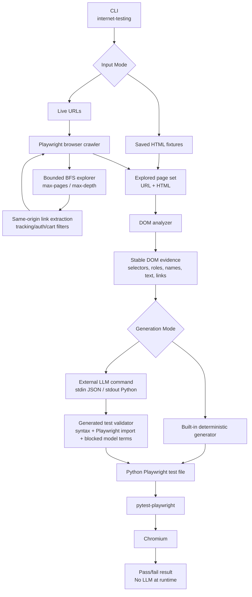

# Architecture Design

## Purpose

Internet Testing is a bounded website exploration tool that captures DOM evidence
from real websites and turns that evidence into Python Playwright tests. The
generation step can use an external model command, but the generated test files
are plain Playwright tests and run without any model dependency.

The core workflow is:

1. Explore a website URL with Playwright.
2. Crawl same-origin pages in deterministic breadth-first order.
3. Extract stable DOM evidence from each captured page.
4. Generate Python Playwright tests from that evidence.
5. Validate and run the generated tests without an LLM.

## System Diagram

## Module Responsibilities

`src/internet_testing/cli.py` is the command-line boundary. It accepts live URLs,
saved fixture HTML, crawl limits, output paths, and the optional `--llm-command`.
It is deliberately thin: it coordinates crawling, generation, validation, and
file output without owning selector or crawling policy.

`src/internet_testing/explorer.py` implements deterministic exploration. It uses
a bounded breadth-first search over same-origin links, controlled by
`max_pages` and `max_depth`. This keeps exploration repeatable and prevents
large commerce sites from expanding into unbounded crawls.

`src/internet_testing/analyzer.py` parses HTML and extracts test-worthy DOM
contracts. It prefers stable selectors and accessible names over generated CSS
classes. It also filters weak crawl targets and dynamic controls that are likely
to fail on replay, such as account, login, cart, checkout, and personalized
recommendation surfaces.

`src/internet_testing/generator.py` owns test generation. It supports two modes:
the built-in deterministic generator and the external model command adapter. The
model adapter passes structured DOM evidence to a command through stdin and
expects a complete Python Playwright test file on stdout. The returned file is
validated before being written.

## Design Decisions

### Bounded Crawling

Large Indian commerce websites have huge link graphs, redirects, tracking links,
personalized widgets, login states, and dynamically injected content. An
unbounded crawler would be slow, noisy, and difficult to reproduce. The tool
therefore uses deterministic breadth-first crawling with explicit `--max-pages`
and `--max-depth` limits.

This is not meant to crawl an entire production site. It is meant to produce a
repeatable sample of meaningful pages that can be converted into stable tests.

### Same-Origin Only

The crawler follows same-origin links only. This avoids drifting into payment
providers, social links, seller portals, CDNs, app stores, and tracking domains.
The goal is to test the target website, not the wider internet around it.

### Stable Selector Preference

The analyzer prioritizes selectors in this order:

1. Specific test attributes such as `data-testid`, `data-test`, `data-qa`, and
   `data-cy`.
2. Accessible names such as `aria-label`.
3. Named form controls.
4. Roles and links.

Generated class names are intentionally avoided because frameworks often produce
hashed or build-dependent classes. Those classes are common on complicated DOMs
but poor test contracts.

### Heuristic Filtering

Some DOM elements are visible during capture but unstable during replay. The
current implementation filters common trouble spots:

- auth and account flows
- cart and checkout paths
- very long tracking URLs
- ad/tracking query patterns
- personalized recommendation labels
- generic test IDs such as `button`, `container`, or `text`

These filters are pragmatic. They reduce flaky generated tests while preserving
useful navigation, search, category, and product-surface assertions.

### LLM Isolation

The application does not embed a specific model SDK. Instead, `--llm-command`
lets any external generator read structured DOM evidence from stdin and write a
Python Playwright test file to stdout.

This keeps the tool provider-agnostic. It also creates a hard separation between
the model-assisted generation phase and the deterministic execution phase.

### Runtime Validation

Generated tests are validated before being written:

- The file must compile as Python.
- It must import `Page` and `expect` from `playwright.sync_api`.
- It must not contain blocked model-provider terms such as `openai`,
  `anthropic`, `langchain`, `llama`, `chatgpt`, or `litellm`.

This does not prove the generated tests are semantically perfect, but it prevents
the most important class of failure for this project: tests that still depend on
an LLM at execution time.

## Current Evidence

The repository includes two kinds of evidence.

Fixture evidence:

- `tests/fixtures/swiggy_complex.html`
- `tests/fixtures/zomato_complex.html`
- `examples/test_generated_indian_sites.py`

Live deep-crawl evidence:

- `examples/test_generated_live_flipkart_deep.py`
- `examples/test_generated_live_amazon_in_deep.py`

The live generated tests for Flipkart and Amazon India were run with Chromium
through `pytest-playwright` and passed. Zomato live crawling failed from this
environment with HTTP/2 transport errors, so Zomato is covered through the
committed complex fixture.

## Known Limitations

The crawler mostly explores links. It does not yet perform deeper deterministic
interactions such as typing into search boxes, selecting filters, opening menus,
scrolling infinite lists, handling location prompts, or dismissing overlays.

The analyzer is heuristic. It can produce weak assertions if a site exposes
unstable accessible labels or hides elements differently between capture and
replay. Some filtering exists, but the scoring model is still basic.

The external LLM path validates output shape and blocked terms, but it does not
yet validate a structured intermediate plan. A model could still produce a
syntactically valid test that is low value or flaky.

The live crawler depends on the network, browser automation, and each site's bot
or transport behavior. Some websites, including Zomato from this environment,
can fail before DOM capture.

## Future Improvements

### Add an Exploration Manifest

Persist a JSON manifest for every run. It should include:

- start URLs
- visited URLs
- skipped URLs with reasons
- depth and parent link
- extracted element counts
- generated assertions
- replay results

This would make debugging and audits much easier.

### Add Deterministic Interaction Recipes

The next major upgrade should explore more than links. Useful deterministic
recipes include:

- open navigation menus
- type safe search terms
- submit search forms
- apply visible filters
- expand accordions
- scroll lazy-loaded sections
- dismiss common overlays

Each recipe should be bounded, logged, and replayable.

### Introduce Selector Scoring

Replace the current simple selector ordering with a scoring model that considers:

- uniqueness on the page
- visibility during capture
- visibility during replay
- accessible role quality
- text stability
- generic or personalized wording

The generator could then emit only high-confidence assertions.

### Use a Structured LLM Plan

Instead of asking an LLM to directly write Python, require it to emit a JSON test
plan first. The application can validate the plan, reject unsafe steps, and
render Playwright code deterministically from the accepted plan.

This would preserve LLM flexibility while improving reproducibility.

### Add Replay-Based Pruning

After generating a test file, automatically run it once and remove or quarantine
assertions that fail because of visibility, redirect, or personalization issues.
The final output would contain only assertions that passed replay.

### Add Site Profiles

Complex sites often need small deterministic profiles. Examples:

- location prompt handling
- region or language selection
- known overlay dismissal
- blocked path patterns
- preferred seed search terms

Profiles should be optional and data-driven so the core crawler remains generic.

### Improve CI Integration

Add a CI workflow that runs unit tests on every commit and optionally runs live
generated Playwright tests on a schedule. Live tests should be separated from
fast unit checks because external websites can fail for reasons outside the
tool's control.
